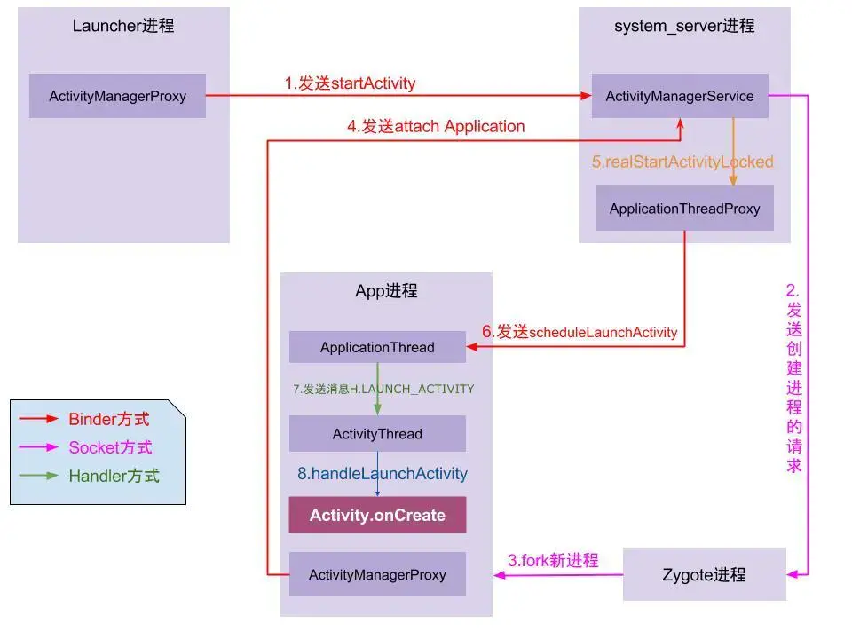

## Activity启动流程与细节

[TOC]

## [Android13源码](https://github.com/aosp-mirror/platform_frameworks_base/releases/tag/android-13.0.0_r37)

```shell
git clone -b android-13.0.0_r37  git@github.com:aosp-mirror/platform_frameworks_base.git --depth = 1
```





### 简单介绍

1.点击图标，Launcher向AMS请求创建根Activity
2.如果无进程，AMS通知Zygote  fork出 目标进程 进入 Main函数  
3.main函数 将当前applicationThread关联到Ams
4.AMS通过ApplicationThread发送launch消息到ActivityThread.H

### 源码细节

#### 1.Launcher进程与SystemServer

- Launcher -> AMS     startActivity

- AMS -> Launcher     pause消息
  
  
  
  ```java
  private void handlePauseActivity (){
  		...pause操作
  	//通知AMSpause完了
     ActivityManagerNative.getDefault().activityPaused(token);
   }                 
  ```

#### 2.SystemServer与APP

AMS->ActivityTaskSupervisor

ActivityTaskSupervisor.  startSpecificActivity()
 └如果进程不存在：请求AMS与zygote通信孵化进程startProcessAsync，待attach完毕，realStartActivityLocked
 └进程存在：直接realStartActivityLocked	

realStart -> scheduleLaunch

#### 3.ActivityThread

ActivityThread.handleLaunchActivity->
    └Activity.onCreate   : 关联contentView与decorView
	└handleResumeActivity
       └Activity.onStart->
       └Activity.onResume->
       └WindowManager.addView->

```java
 //=======ActivityThread.java=======


  public static void main(String[] args) {
        Looper.prepareMainLooper();
		
        ActivityThread thread = new ActivityThread();
        thread.attach(false, startSeq);
     		//ActivityManager.getService().attachApplication(mAppThread, startSeq); 
     //Ams发送BIND_APPLICATION消息
       	Looper.loop();
   }


 private void handleLaunchActivity(ActivityClientRecord r,
            PendingTransactionActions pendingActions, Intent customIntent）{
      ......
      WindowManagerGlobal.initialize();//初始化WMS服务
      ......
      Activity a = performLaunchActivity(r, customIntent);
 }


private Activity performLaunchActivity(ActivityClientRecord r, Intent customIntent) {
    		//mInstrumentation - new Actvitiy 
    		//mInstrumentation - new Application
				//activity.attach(appContext) => 1.new phonewindow().setWindowManager() 
				//mInstrumentation.callActivityOnCreate 
				//setContentView()=>Phonewindow.setContentView() =>installdecor关联contentView
}

 //========ActivityThread.java======
 final void handleResumeActivity(ActivityClientRecord r...){
       ......
       performResumeActivity(token, clearHide, reason);
     
       View decor = r.activity.getWindow().getDecorView();

       r.activity.getWindowManager().addView(decor, layoutparams);//decor添加到window
       ......
 }
```

#### 4.ViewRootImpl绘制任务

ViewRootImpl.setView->
ViewRootImpl.requestLayout->
 └ViewRootImpl.scheduleTraversals->
 └Choreographer.postCallback->

```java

class ViewRootImpl{
   // setView()
    //-->requestLayout()
    //-->scheduleTraversals()  不是立即执行，只是将任务丢给 Choreographer 

      void scheduleTraversals(){
          //发送同步屏障,屏蔽默认handler发送的同步消息
         mHandler.getLooper().getQueue().postSyncBarrier();
   		//Posts a callback to run on the next frame（当vsync信号来之后执行）
			//该消息是异步的，绘制任务得以优先于异步消息执行
      mChoreographer.postCallback(
                          Choreographer.CALLBACK_TRAVERSAL, mTraversalRunnable, null);
      }


  	void  doTraversal(){
				//移除同步屏障
 			 mHandler.getLooper().getQueue().removeSyncBarrier(mTraversalBarrier);   
				//绘制
    	 performTraversals（）
    } 

	void performTraversals(){
        final View host = mView;
			  host.dispatchAttachedToWindow()  //使用handler发送消息
        performMeasure()
				performLayout()
				performDraw()    
    }  
    
    final class TraversalRunnable implements Runnable {
        @Override
        public void run() {
            doTravesal()
        }
    }

    private void performTraversals() {
        //伪代码
		  View.dispatchAttachedToWindow(){
             	mAttachInfo = info;
				//执行延迟的任务队列	
              	mRunQueue.executeActions(info.mHandler);
          }
    }
}

//收到系统vsync信号，才会开始实际绘制任务

public final class Choreographer {
    
	   private final class FrameHandler extends Handler {
        public FrameHandler(Looper looper) {
            super(looper);
        }

        @Override
        public void handleMessage(Message msg) {
            switch (msg.what) {
                case MSG_DO_FRAME:
                    doFrame();//-->doCallbacks(Choreographer.CALLBACK_TRAVERSAL);
                    break;
            }
        }
    }
	
     private final class FrameDisplayEventReceiver extends DisplayEventReceiver
            implements Runnable {
         
         public void onVsync(){
             //mFrameHandler发送一条 异步消息 MSG_DO_FRAME = 0
         }
     } 
}
```


### 题外话：绘制耗时

```java
@Override


protected void onResume() {

super.onResume();

final long start = System.currentTimeMillis();

getWindow().getDecorView().post(new Runnable() {

       Log.d(TAG, "onPause cost:" + (System.currentTimeMillis() - start));

    }
```