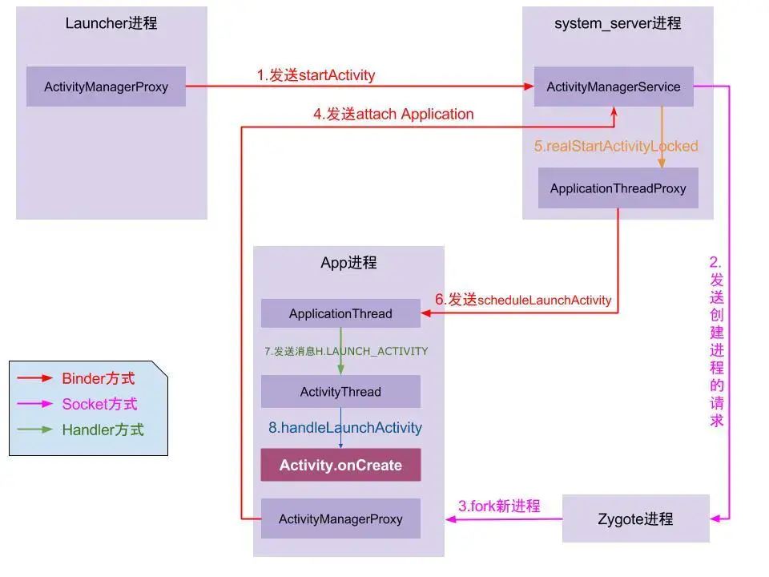

## UI绘制流程

[TOC]

## [Android13源码](https://github.com/aosp-mirror/platform_frameworks_base/releases/tag/android-13.0.0_r37)

```shell
git clone -b android-13.0.0_r37  git@github.com:aosp-mirror/platform_frameworks_base.git --depth = 1
```





### Activity启动简单介绍

1.点击图标，Launcher向AMS请求创建根Activity
2.如果无进程，AMS通知Zygote  fork出 目标进程 进入 Main函数  
3.main函数 将当前applicationThread :binder关联到Ams
4.AMS通过ApplicationThread发送launch消息到ActivityThread.H

### 源码细节

#### 1.Launcher进程与SystemServer进程

- Launcher -> AMS     startActivity

- AMS -> Launcher     pause消息
  
  
  
  ```java
  private void handlePauseActivity (){
  		...pause操作
  	//通知AMSpause完了
     ActivityManagerNative.getDefault().activityPaused(token);
   }                 
  ```

#### 2.SystemServer与APP进程

AMS->ActivityTaskSupervisor

ActivityTaskSupervisor.  startSpecificActivity()
 └如果进程不存在：请求AMS与zygote通信孵化进程startProcessAsync，待attach完毕，realStartActivityLocked
 └进程存在：直接realStartActivityLocked	

realStart -> scheduleLaunch

#### 3.ActivityThread

ActivityThread.handleLaunchActivity->Activity.onCreate   : 关联contentView与decorView
	└handleResumeActivity
       └Activity.onStart->
       └Activity.onResume->
       └WindowManager.addView->

```java
 //=======ActivityThread.java=======


  public static void main(String[] args) {
        Looper.prepareMainLooper();
		
        ActivityThread thread = new ActivityThread();
        thread.attach(false, startSeq);
     		//ActivityManager.getService().attachApplication(mAppThread, startSeq); 
     //Ams发送BIND_APPLICATION消息
       	Looper.loop();
   }


 private void handleLaunchActivity(ActivityClientRecord r,
            PendingTransactionActions pendingActions, Intent customIntent）{
      ......
      WindowManagerGlobal.initialize();//初始化WMS服务
      ......
      Activity a = performLaunchActivity(r, customIntent);
 }


private Activity performLaunchActivity(ActivityClientRecord r, Intent customIntent) {
    		//mInstrumentation - new Actvitiy 
    		//mInstrumentation - new Application
				//activity.attach(appContext) => 1.new phonewindow().setWindowManager() 
				//mInstrumentation.callActivityOnCreate 
				//setContentView()=>PhoneWindow.setContentView() =>new DecorView()关联contentView
}

 final void handleResumeActivity(ActivityClientRecord r...){
       ......
       performResumeActivity(token, clearHide, reason);
     
       View decor = r.activity.getWindow().getDecorView();
				//WindowManagerImpl.addView->WindowManagerGlobal.addView
       r.activity.getWindowManager().addView(decorView)
       ......
 }

//=======WindowManagerGlobal.java //管理所有ViewRootImpls

		private final ArrayList<View> mViews;
    private final ArrayList<ViewRootImpl> mRoots;
		private final ArrayList<WindowManager.LayoutParams> mParams;
    public void addView(View view, ViewGroup.LayoutParams params,
            Display display, Window parentWindow, int userId) {
			//new ViewRootImpl.setView 管理decorview(此时decor已经关联了contentView)
			//主线程创建的ViewRootImpl
		   ViewRootImpl root =	new ViewRootImpl(view.getContext(), display,
               windowlessSession)
		   mViews.add(view);
       mRoots.add(root);
       mParams.add(wparams);	
			 root.setView(view, wparams, panelParentView, userId);
    }


```

#### 4.ViewRootImpl绘制任务实际执行

ViewRootImpl.setView 
 └ViewRootImpl.requestLayout-> 
 └ViewRootImpl.scheduleTraversals->
 └Choreographer.postCallback->

```java

class ViewRootImpl{
   		// setView()->requestLayout()
			void setView(View view, WindowManager.LayoutParams attrs, View panelParentView,
            int userId){
						//decorview的parent就是ViewRootImpl
            view.assignParent(this);
						//..
						requestLayout()
      }
			
      void requestLayout() {
            if (!mHandlingLayoutInLayoutRequest) {
						//检测ViewRootImpl创建线程和当前绘制线程是否一致，不一致抛异常：CalledFromWrongThreadException		
                checkThread();
                mLayoutRequested = true;
                  //不是立即执行，只是将任务丢给 Choreographer 
                scheduleTraversals();
            }
        }

		    public ViewParent invalidateChildInParent(int[] location, Rect dirty) {
							//检测ViewRootImpl创建线程和当前绘制线程是否一致，不一致抛异常：CalledFromWrongThreadException
             checkThread();
              if (dirty == null) {
									//最终也会调用scheduleTraversals（）
                  invalidate();
                  return null;
              } else if (dirty.isEmpty() && !mIsAnimating) {
                  return null;
              }
        }

      void scheduleTraversals(){
          //发送同步屏障,屏蔽默认handler发送的同步消息
         mHandler.getLooper().getQueue().postSyncBarrier();
   		//Posts a callback to run on the next frame（当vsync信号来之后执行）
			//该消息是异步的，在一个vsync周期优先于同步消息执行，
      //卡顿原因1.此时如果有其他耗时消息在分发 就可能会掉帧

		//这里异步消息类型有 
        //input
        //animation
        //travesal,
			//commit 当前frame已经提交给gpu	
      mChoreographer.postCallback(
                          Choreographer.CALLBACK_TRAVERSAL, mTraversalRunnable, null);
      }

    final class TraversalRunnable implements Runnable {
        @Override
        public void run() {
            doTraversal(){
               //移除同步屏障
               mHandler.getLooper().getQueue().removeSyncBarrier(mTraversalBarrier);   
                //绘制
               performTraversals（）
            }
        }
    }

	void performTraversals(){
        final View host = mView;//decorView
    		if(mFirst){
          	//decorview 分发 AttachInfo到子view，标志view已经被添加到window
						//view.post的任务mRunQueue此时可以执行了
            host.dispatchAttachedToWindow(mAttachInfo, 0);
						mAttachInfo.mTreeObserver.dispatchOnWindowAttachedChange(true);
        }
				getRunQueue().executeActions(mAttachInfo.mHandler);
				//开启绘制
        performMeasure()
				performLayout()
				performDraw()    
    }  
    
    final class TraversalRunnable implements Runnable {
        @Override
        public void run() {
            doTravesal()
        }
    }

    private void performTraversals() {
        //伪代码
		  View.dispatchAttachedToWindow(){
             	mAttachInfo = info;
				//执行延迟的任务队列	
              	mRunQueue.executeActions(info.mHandler);
          }
    }
}

//收到系统vsync信号，才会开始实际绘制任务
//负责请求和接收 Vsync 信号
public final class Choreographer {
    
	   private final class FrameHandler extends Handler {
        public FrameHandler(Looper looper) {
            super(looper);
        }

        @Override
        public void handleMessage(Message msg) {
            switch (msg.what) {
                case MSG_DO_FRAME:
                		//卡顿原因2.过度绘制下一个信号来时候这一帧还没绘制完成
                    doFrame();//-->doCallbacks(Choreographer.CALLBACK_TRAVERSAL);
                    break;
            }
        }
    }
	
     private final class FrameDisplayEventReceiver extends DisplayEventReceiver
            implements Runnable {
         
         public void onVsync(){
             //mFrameHandler发送一条 异步消息 MSG_DO_FRAME = 0
         }
     } 
}
```

### **渲染时序图**

```xml
VSYNC 信号
    ↓
Input处理（CALLBACK_INPUT）
    ↓
Animation更新（CALLBACK_ANIMATION）
    ↓
Traversal（measure/layout/draw）完成（CALLBACK_TRAVERSAL）
    ↓
提交到 GPU / Surface（CALLBACK_COMMIT） ← 你关注的阶段
    ↓
屏幕显示
```


### 获取view宽高

```kotlin
    private fun getMeasuredWidthHeight() {
        //拿不到
        Handler(Looper.getMainLooper()).post{
            Log.d("MainActivity-handler.post","width:${binding.root.width},height:${binding.root.height} ")
        }
        //可以
        binding.root.doOnLayout {
            Log.d("MainActivity-doOnLayout","width:${binding.root.width},height:${binding.root.height} ")
        }
        //可以
        binding.root.doOnPreDraw {
            Log.d("MainActivity-doOnPreDraw","width:${binding.root.width},height:${binding.root.height} ")
        }
        //可以
        binding.root.post {
            Log.d("MainActivity-view.post","width:${binding.root.width},height:${binding.root.height} ")
        }
    }
```

### View.invalidate与requestLayout 与主动触发绘制线程异常

requestLayout方法会导致view measure与layout，而draw不一定被执行

Invalidate 只会导致draw重新执行

```java
public class View{	
      void invalidateInternal(int l, int t, int r, int b, boolean invalidateCache,
              boolean fullInvalidate) {// 3
              ...
              final ViewParent p = mParent;
              if (p != null && ai != null && l < r && t < b) {
									//触发绘制点1：递归到ViewRootImpl.invalidateChild =>checkThread
                  p.invalidateChild(this, damage);
              }
            
              ...
      }

		public void requestLayout() {
                 //触发绘制点2：递归到ViewRootImpl.requestLayout =>checkThread
 				if (mParent != null && !mParent.isLayoutRequested()) {
            mParent.requestLayout();
        }
    }
}
```

都是**逐步向上请求**的过程，decorview的viewParent是ViewRootImpl,到这里后checkThread会执行，导致
`CalledFromWrongThreadException`
即只有创建ViewRootImpl 即view树的线程可以修改其中的view 

**为何要检查主线程？**
Android中的**UI 组件（View）不是线程安全的 ,Measure → Layout → Draw是单线程串行执行的。

**例外：**

- 在onCreate中进行子线程更新UI：由于ViewRootImpl还没创建，绘制任务还没开始，所以不会出问题

