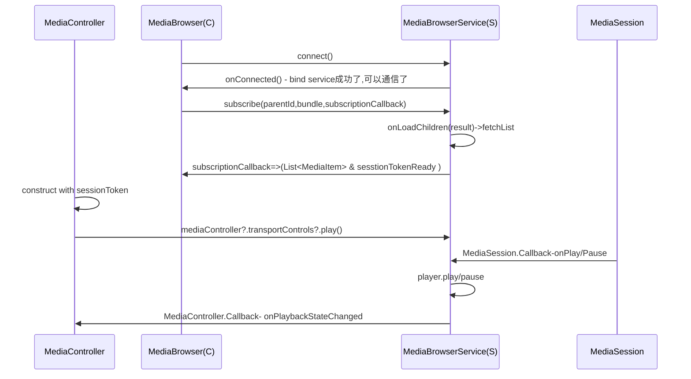

## Media

### 一、 MediaSession框架
google:https://developer.android.google.cn/media/legacy/audio?hl=zh-cn
csdn:https://blog.csdn.net/liuning1985622/article/details/138476817

MediaSession框架是google在android5之后引入的一个音乐播放框架，用来解决音乐界面和服务之间的通信问题，它的主要作用是规范了媒体服务和界面的通信接口，达到了完全解耦，可以自由、高效进行媒体的切换。




### 二、ClientApp ：Launcher获取MediaController方式

```kotlin

//1.CarMediaManager 监听MediaSource改变，普遍的 需要媒体服务在真正开始播放的时候carMediaManager.setMediaSource && setActive(true)
//launcher需要在不播放的情况下拿到不同源的歌单状态因此考虑这样的方式去拿
carMediaManager = Car.createCar(context).getCarManager(Car.CAR_MEDIA_SERVICE) as CarMediaManager
=>carMediaManager?.addMediaSourceListener(listener:MediaSourceChangedListener)
=>onMediaSourceChanged(ComponentName componentName)
=>MediaBrowserCompat(componentName,mediaBrowserConnectionCallback)
=>MediaControllerCompat(context, mMediaBrowserCompat.sessionToken)

//2.MediaSessionManager 监听MediaSession 依赖于播放
val mediaSessionManager =
                context.getSystemService(Context.MEDIA_SESSION_SERVICE) as MediaSessionManager
mediaSessionManager.addOnActiveSessionsChangedListener()
=>onActiveSessionsChanged(controllers: MutableList<MediaController>?)
=>activeController = controllers.filter(playbackState.state == PlaybackState.STATE_PLAYING)
=> MediaControllerCompat(context,MediaSessionCompat.Token.fromToken(activeController.sessionToken))

```

### 三、媒体服务进程介绍

hcp3媒体项目除了主进程外，还有 具体播放口名称等分别负责不同的媒体播放维护

原则上，主进程作为客户端，只负责ui调度

### 四、音频焦点处理

**Gain: 获取焦点  Loss:丢失焦点  Transient:短暂的 Duck:回避** 

| **焦点变化常量 (focusChange)**               | **播放器推荐 Action**                                        | **是否放弃焦点 (abandon)**             | 场景                   |
| -------------------------------------------- | ------------------------------------------------------------ | -------------------------------------- | ---------------------- |
| **AUDIOFOCUS_GAIN**                          | 恢复音量；如果之前是被动暂停的则**恢复播放**。激活session    | 否                                     | 获取了焦点             |
| **AUDIOFOCUS_LOSS**                          | 立即暂停，并丢弃焦点                                         | **是** (调用 abandonAudioFocusRequest) | 用户打开了另一个播放器 |
| **AUDIOFOCUS_LOSS_TRANSIENT**                | **立即暂停**播放,等焦点回来继续                              | 否                                     | 电话进来、语音助理启动 |
| **AUDIOFOCUS_LOSS_<br />TRANSIENT_CAN_DUCK** | 降低音量或暂停等焦点,<br /><br />如果request设置了setWillPauseWhenDucked（true）,则不会回调该值 | 否                                     | 导航播报、通知音       |

在真正play之前，调用requestAudioFocus()，根据返回结果判断是否启动播放


```kotlin
import android.content.Context
import android.media.AudioAttributes
import android.media.AudioFocusRequest
import android.media.AudioManager
import android.os.Build
import android.os.Handler
import android.os.Looper
import androidx.annotation.RequiresApi
import java.util.concurrent.TimeUnit

class AudioFocusHelper(
    private val context: Context,
    private val player: PlayerInterface // 播放器接口
) {

    private val audioManager = context.getSystemService(Context.AUDIO_SERVICE) as AudioManager
    private val handler = Handler(Looper.getMainLooper())

    private val focusLock = Any()
    private var playbackDelayed = false
    private var resumeOnFocusGain = false

    // 延时停止任务：用于 LOSS 状态后彻底释放资源
    private val delayedStopRunnable = Runnable {
        println("Focus: Permanent loss timeout reached. Stopping and abandoning focus.")
        player.stop()
        abandonFocus()
    }

    // 1. 定义监听器
    private val afChangeListener = AudioManager.OnAudioFocusChangeListener { focusChange ->
        when (focusChange) {
            AudioManager.AUDIOFOCUS_GAIN -> {
                println("Focus: GAIN")
                // 取消延时停止
                handler.removeCallbacks(delayedStopRunnable)
                // 检查是否需要恢复播放
                synchronized(focusLock) {
                    if (playbackDelayed || resumeOnFocusGain) {
                        playbackDelayed = false
                        resumeOnFocusGain = false
                        player.play()
                    }
                }
            }

            AudioManager.AUDIOFOCUS_LOSS -> {
                println("Focus: LOSS (Permanent)")
                // 永久失去焦点：立即暂停，不再自动恢复
                synchronized(focusLock) {
                    resumeOnFocusGain = false
                    playbackDelayed = false
                }
                player.pause()
                // 启动 30 秒倒计时，超时则彻底 Stop 并释放
                handler.postDelayed(delayedStopRunnable, TimeUnit.SECONDS.toMillis(30))
            }

            AudioManager.AUDIOFOCUS_LOSS_TRANSIENT -> {
                println("Focus: LOSS_TRANSIENT")
                // 临时失去焦点（如电话）：暂停并记录状态以便恢复
                synchronized(focusLock) {
                    resumeOnFocusGain = player.isPlaying()
                    playbackDelayed = false
                }
                player.pause()
            }

            AudioManager.AUDIOFOCUS_LOSS_TRANSIENT_CAN_DUCK -> {
                println("Focus: LOSS_TRANSIENT_CAN_DUCK")
								//由于设置了setWillPauseWhenDucked(true)，就会回调到transient
                // 临时失去焦点（如电话）：暂停并记录状态以便恢复
                synchronized(focusLock) {
                    resumeOnFocusGain = player.isPlaying()
                    playbackDelayed = false
                }
                player.pause()
            }
        }
    }

    // 2. 构建 FocusRequest (API 26+)
    private val focusRequest: AudioFocusRequest by lazy {
        AudioFocusRequest.Builder(AudioManager.AUDIOFOCUS_GAIN).run {
            setAudioAttributes(AudioAttributes.Builder().run {
                setUsage(AudioAttributes.USAGE_GAME)
                setContentType(AudioAttributes.CONTENT_TYPE_MUSIC)
                build()
            })
            //如果系统触发 Duck，是否自动暂停播放（true 则不降音量直接暂停）
						//系统会发送 AUDIOFOCUS_LOSS_TRANSIENT
            setWillPauseWhenDucked(true) 
            // 允许延迟获取焦点（例如在通话时请求焦点，通话结束后会自动分配焦点）
            setAcceptsDelayedFocusGain(true)
            setOnAudioFocusChangeListener(afChangeListener, handler)
            build()
        }
    }

    /**
     * 请求播放并处理焦点
     */
    fun requestPlayback() {
        val res = audioManager.requestAudioFocus(focusRequest)
        
        synchronized(focusLock) {
            when (res) {
                AudioManager.AUDIOFOCUS_REQUEST_FAILED -> {
                    println("Focus Request: FAILED")
                    // 无法播放
                }
                AudioManager.AUDIOFOCUS_REQUEST_GRANTED -> {
                    println("Focus Request: GRANTED")
                    player.play()
                }
                AudioManager.AUDIOFOCUS_REQUEST_DELAYED -> {
                    println("Focus Request: DELAYED")
                    // 标记为等待中，不立即播放
                    playbackDelayed = true
                }
            }
        }
    }

    /**
     * 放弃焦点（用户手动点击 Stop 或退出应用时调用）
     */
    fun abandonFocus() {
        handler.removeCallbacks(delayedStopRunnable)
        audioManager.abandonAudioFocusRequest(focusRequest)
    }

    // 模拟播放器接口
    interface PlayerInterface {
        fun play()
        fun pause()
        fun stop()
        fun isPlaying(): Boolean
        fun setVolume(volume: Float)
    }
}
```


